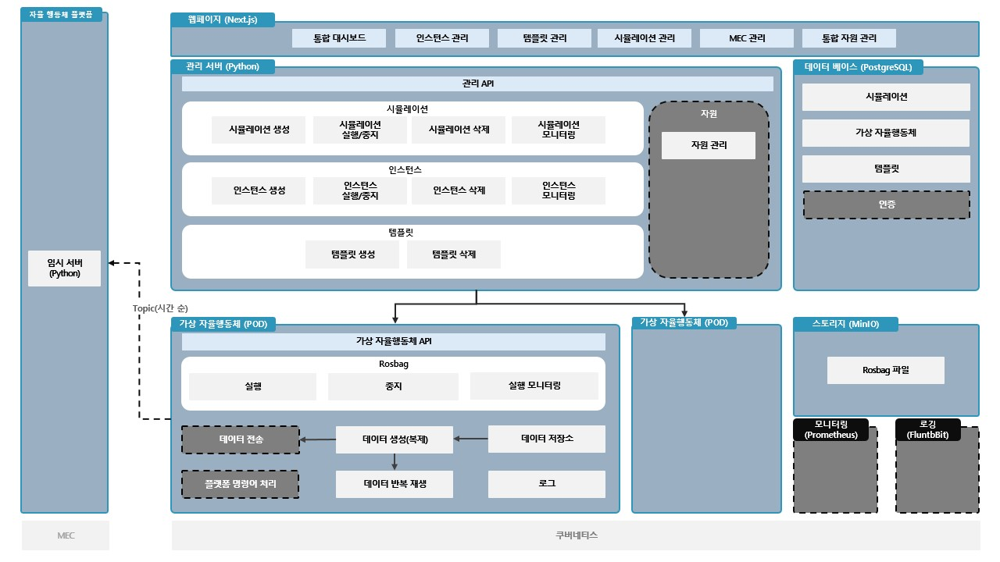

# Robot Simulator Back
자율행동체 시뮬레이터 플랫폼

---

### 개발 환경
- **Language**: Python 3.10.12
- **Container**: Docker 27.3.1
- **Container Orchestration Tool**: Kubernetes 1.30.5


## 실행 가이드

### 저장소 Clone

```bash
git clone https://(private token)@github.com/inno-rnd-project/robot-simulator-back.git
```

이후 작업은 해당 디렉토리별 리드미에 작성되어 있습니다.

<table>
    <tr>
        <th scope="col">디렉토리</th>
        <th scope="col">설명</th>
        <th scope="col">리드미 바로가기</th>
    </tr>
    <tr>
        <td>backend_server</td>
        <td>자율행동체 시뮬레이터 플랫폼 서버</td>
        <td><a href="https://github.com/Open-Edge-Robotics/A.RobotAI-Robot-Simulator-Back/blob/main/backend_server">바로가기</a></td>
    </tr>
    <tr>
        <td>k8s</td>
        <td>쿠버네티스 배포 스크립트 모음</td>
        <td><a href="https://github.com/Open-Edge-Robotics/A.RobotAI-Robot-Simulator-Back/tree/main/k8s">바로가기</a></td>
    </tr>
    <tr>
        <td>pod_server</td>
        <td>자율행동체 인스턴스(Pod) API</td>
        <td><a href="https://github.com/Open-Edge-Robotics/A.RobotAI-Robot-Simulator-Back/tree/main/pod_server">바로가기</a></td>
    </tr>
  </table>

<br>

### 전체 아키텍쳐 구조도



