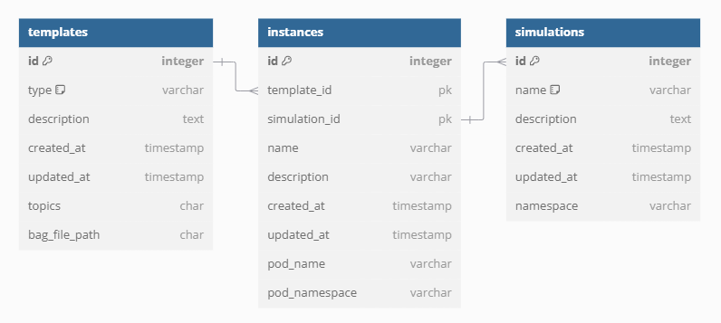

# Backend Server
자율행동체 시뮬레이터 서버

<br>

## 소개

### 사전 요구 사항
- **Name**: backend_server
- **Language**: Python 3.10.12
- **Build System**: pip
- **Environment Management**: venv

### 패키지
#### requirements.txt
```
asyncpg==0.30.0
fastapi==0.115.5
kubernetes==31.0.0
pydantic==2.9.2
pydantic-settings==2.6.1
Pygments==2.18.0
python-dotenv==1.0.1
PyYAML==6.0.2
SQLAlchemy==2.0.36
sqlmodel==0.0.22
starlette==0.41.2
uvicorn==0.31.1
minio==7.2.10
asyncio
requests
```

### 환경 변수
```
# DB Url
DATABASE_URL=DATABASE_URL

# Minio
MINIO_URL=MINIO_URL
MINIO_ACCESS_KEY=MINIO_ACCESS_KEY
MINIO_SECRET_KEY=MINIO_SECRET_KEY
MINIO_BUCKET_NAME=MINIO_BUCKET_NAME

# Api
API_STR=/api

# Postgresql
POSTGRES_USER=POSTGRES_USER
POSTGRES_PASSWORD=POSTGRES_PASSWORD
POSTGRES_DB=POSTGRES_DB
PGDATA=/var/lib/postgresql/pgdata
```

<br>

## 실행 가이드 - 공통

### 1. 가상 환경 생성 및 활성화
명령줄(cmd)에서 프로젝트 디렉토리로 이동한 후 가상 환경을 생성하고 활성화합니다.

```bash
cd backend_server
python -m venv <가상환경 이름>
```

```bash
source <가상환경 이름>/bin/activate
```

### 2. 패키지 설치

```bash
pip install -r requirements.txt
```

3번 부터는 [실행 가이드 - 로컬](#실행-가이드---로컬) 혹은 [실행 가이드 - 원격](#실행-가이드---원격)을 선택하여 진행해주세요.


## 실행 가이드 - 로컬
**현재 로컬에서는 쿠버네티스와 관련된 API를 제외하고 테스트할 수 있습니다.**

### 3. 서버 실행

명령줄(cmd)에서 루트 디렉토리로 이동한 후 서버를 실행합니다.

```bash
cd ..
python runserver.py
```
runserver.py 대신 uvicorn 명령어를 직접 사용할 수도 있습니다.  
`uvicorn backend_server.src.main:app --reload`


## 실행 가이드 - 도커 이미지 기반
**해당 프로젝트는 기본적으로 `Openstack 192.168.160.135 인스턴스`에 세팅된 Kubernetes 환경에서 실행할 수 있습니다.   
가이드는 '192.168.160.135' 환경 기준으로 설명합니다.**


### 3. Docker 로그인

```bash
docker login
```


### 4. Docker 이미지 빌드 및 Docker Hub에 이미지 push
**backend_server 디렉토리**에서 Docker 이미지를 빌드합니다.

```bash
docker build -t <username>/robot:<tag> .
```

Docker Hub에 이미지를 push 합니다.
```bash
docker push <username>/robot:<tag>
```


### 5. ssh 접속

```bash
ssh root@192.168.160.135
```
> PW: qwe1212!Q


### 6. 원격 배포

Docker Hub로부터 이미지를 pull 합니다.
```bash
docker pull <username>/robot:<tag>
```

쿠버네티스 내의 백엔드 서버 이미지 이름을 변경해야 합니다.
다음 가이드의 3번부터 따라 진행해주세요.  
[Docker 이미지 변경하는 경우](#3-server-deployyaml-수정)


저장된 배포 스크립트를 apply 합니다.
```bash
cd robot
kubectl apply -f server-deploy.yaml
```


<br>

## 배포 서버 (192.168.160.135)
### namespaces
`$ kubectl get namespaces -A`

<table>
    <tr>
        <th scope="col">이름</th>
        <th scope="col">설명</th>
    </tr>
    <tr>
        <td>default</td>
        <td>비어있음</td>
    </tr>
    <tr>
        <td>kube-node-lease</td>
        <td>(default) 비어있음</td>
    </tr>
    <tr>
        <td>kube-public</td>
        <td>(default) 비어있음</td>
    </tr>
    <tr>
        <td>kube-system</td>
        <td>(default) 쿠버네티스 시스템</td>
    </tr>
    <tr>
        <td>kubernetes-dashboard</td>
        <td>쿠버네티스 대시보드 관련 시스템</td>
    </tr>
    <tr>
        <td>mymonitoring</td>
        <td>Prometheus, Grafana 관련 시스템</td>
    </tr>
    <tr>
        <td>robot</td>
        <td>minio, postgresql, API 서버 파드</td>
    </tr>
    <tr>
        <td>simulation-&lt;simulationId&gt;</td>
        <td>
            생성되는 시뮬레이션의 네임스페이스. 인스턴스 파드들이 속해 있음<br>
            인스턴스 파드 네이밍 규칙: instance-&lt;simulationId&gt;-&lt;instanceId&gt;
        </td>
    </tr>
  </table>


<br>


## Docker 이미지 변경하는 경우
### 1. Docker 이미지 빌드 및 Docker Hub에 push
[사용 가이드](#5-docker-이미지-빌드-및-docker-hub에-이미지-push) 내용과 동일하게 진행합니다.

### 2. ssh 접속 및 Docker Hub에서 이미지 pull
[사용 가이드](#6-ssh-접속-및-배포) 내용과 동일하게 진행합니다.

### 3. `server-deploy.yaml` 수정
server-deploy.yaml 파일의 아래 내용을 변경할 이미지명으로 수정합니다.
```yaml
spec:
  containers:
    - name: robot-deploy
      image: innoagent/robot:1.1  # 이 부분을 변경할 이미지(<username>/robot:<tag>)로 수정
```

참고: 현재 모든 컨테이너의 기반 이미지는 `innoagent(개인 계정입니다)`에서 가져오도록 설정되어 있습니다.  
추후 개발 시 본인 계정으로 변경 및 적용해주세요.

### 4. 백엔드 서버 재시작
배포 서버를 재시작합니다.
```bash
kubectl delete pod <backend-server-deploy-pod> -n <namespace>
```


## API

호출할 수 있는 API는 `routes` 폴더에 정의되어 있습니다.  
예를 들어, `http://192.168.160.135:30020/api/instance` 와 같은 형태로 호출할 수 있습니다.

```
.
├── routes
│   ├── instance.py
│   ├── rosbag.py
│   ├── simulation.py
│   └── template.py
```

<br>

## ERD



