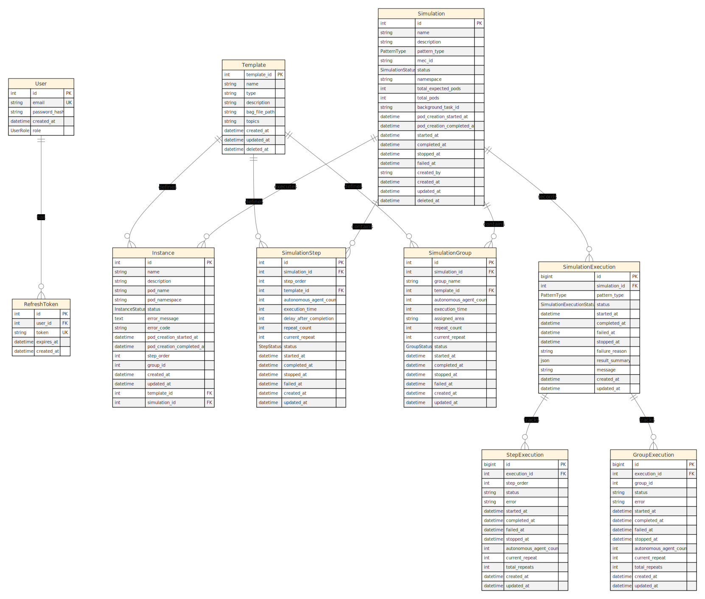
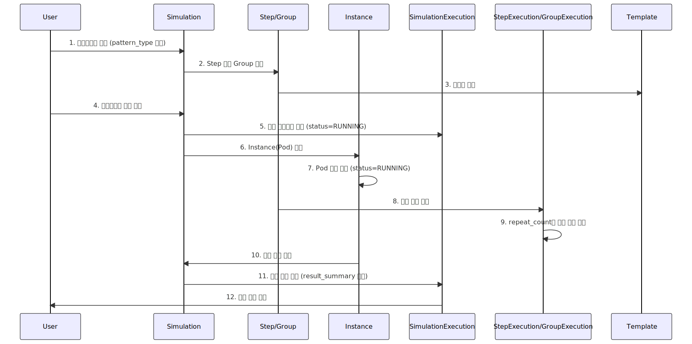

# ERD - Autonomous Agent Simulation Management System

**Version:** v1.0
**Generated:** 2025-10-14

---

## 서비스 개요

본 시스템은 가상 자율 행동체 시뮬레이션의 생성, 실행, 모니터링을 관리하는 백엔드 플랫폼입니다. 사용자는 템플릿 기반으로 시뮬레이션을 구성하고, 순차 실행(Step) 또는 병렬 실행(Group) 패턴으로 가상 자율 행동체를 배포할 수 있습니다.

각 시뮬레이션은 독립적인 네임스페이스를 가지며, 시뮬레이션 설정 정보에 따라 필요한 수만큼 Kubernetes Pod 형태의 인스턴스가 생성되어 실행됩니다. 실행 히스토리는 별도의 Execution 테이블에 기록되어 상태와 결과를 추적합니다.

또한 JWT 기반 인증을 통해 사용자 관리를 지원하며, Soft Delete 정책을 적용하여 데이터 무결성과 복구 가능성을 보장합니다.

---

## 시스템 요약 표

| 엔티티                    | 역할                                      | 핵심 관계                                           |
|---------------------------|-------------------------------------------|-----------------------------------------------------|
| **User**                  | 사용자 계정 및 인증 정보 관리             | RefreshToken (1:N)                                  |
| **RefreshToken**          | JWT 리프레시 토큰 저장 및 만료 관리       | User (N:1)                                          |
| **Template**              | 시뮬레이션 실행 템플릿 (BAG 파일 경로 등)| Instance (1:N)                                      |
| **Simulation**            | 시뮬레이션 메타데이터 및 상태 관리        | SimulationStep (1:N), SimulationGroup (1:N), Instance (1:N), SimulationExecution (1:N) |
| **SimulationStep**        | 순차 실행 단계 정의                       | Simulation (N:1), Template (N:1)                    |
| **SimulationGroup**       | 병렬 실행 그룹 정의                       | Simulation (N:1), Template (N:1)                    |
| **Instance**              | Kubernetes Pod 인스턴스 (실제 실행 단위) | Simulation (N:1), Template (N:1)                    |
| **SimulationExecution**   | 시뮬레이션 실행 히스토리 기록             | Simulation (N:1), StepExecution (1:N), GroupExecution (1:N) |
| **StepExecution**         | Step별 실행 히스토리 상세 기록            | SimulationExecution (N:1)                           |
| **GroupExecution**        | Group별 실행 히스토리 상세 기록           | SimulationExecution (N:1)                           |

---

## ER 다이어그램



---

## 엔티티별 상세 설명

### 1. User

사용자 계정 정보를 저장하며, JWT 인증의 주체가 됩니다.

| 필드명          | 타입                      | 제약조건              | 설명                              |
|-----------------|---------------------------|-----------------------|-----------------------------------|
| id              | Integer                   | PK                    | 사용자 고유 ID                    |
| email           | String                    | NOT NULL, UNIQUE      | 사용자 이메일 (로그인 식별자)     |
| password_hash   | String                    | NOT NULL              | bcrypt 해시된 비밀번호            |
| created_at      | DateTime(timezone=True)   | NOT NULL              | 계정 생성 시각                    |
| role            | Enum(UserRole)            | NOT NULL, DEFAULT     | 사용자 권한 (ADMIN/GENERAL)       |

**도메인 메서드:**
- `set_password(raw_password)`: 비밀번호 해싱 후 저장
- `verify_password(raw_password)`: 비밀번호 검증
- `is_admin()`: 관리자 여부 확인

---

### 2. RefreshToken

JWT 리프레시 토큰을 저장하며, 사용자 재인증에 사용됩니다.

| 필드명       | 타입                      | 제약조건              | 설명                          |
|--------------|---------------------------|-----------------------|-------------------------------|
| id           | Integer                   | PK                    | 토큰 레코드 고유 ID           |
| user_id      | Integer                   | FK(users.id), NOT NULL| 소유 사용자 ID                |
| token        | String                    | NOT NULL, UNIQUE      | 리프레시 토큰 문자열          |
| expires_at   | DateTime(timezone=True)   | NOT NULL              | 토큰 만료 시각                |
| created_at   | DateTime(timezone=True)   | NOT NULL              | 토큰 생성 시각                |

**도메인 메서드:**
- `is_expired()`: 토큰 만료 여부 확인
- `extend_expiry(days)`: 만료 기한 연장

---

### 3. Template

시뮬레이션 실행에 사용되는 ROS BAG 파일 및 토픽 정보를 정의합니다.

| 필드명         | 타입                      | 제약조건              | 설명                          |
|----------------|---------------------------|-----------------------|-------------------------------|
| template_id    | Integer                   | PK                    | 템플릿 고유 ID                |
| name           | String                    | NOT NULL              | 템플릿 이름                   |
| type           | String                    | NOT NULL              | 템플릿 타입 (예: ROS2)        |
| description    | String(100)               | NOT NULL              | 템플릿 설명                   |
| bag_file_path  | String                    | NOT NULL              | BAG 파일 경로                 |
| topics         | String                    | NOT NULL              | ROS 토픽 목록 (JSON 문자열)   |
| created_at     | DateTime(timezone=True)   | NOT NULL              | 생성 시각                     |
| updated_at     | DateTime(timezone=True)   | NOT NULL              | 수정 시각                     |
| deleted_at     | DateTime(timezone=True)   | NULLABLE              | Soft Delete 시각              |

**도메인 메서드:**
- `mark_as_deleted()`: Soft Delete 처리
- `is_deleted`: 삭제 여부 확인 (property)

---

### 4. Simulation

시뮬레이션 메타데이터 및 전체 실행 상태를 관리합니다.

| 필드명                      | 타입                          | 제약조건              | 설명                                  |
|-----------------------------|-------------------------------|-----------------------|---------------------------------------|
| id                          | Integer                       | PK                    | 시뮬레이션 고유 ID                    |
| name                        | String(30)                    | NOT NULL              | 시뮬레이션 이름                       |
| description                 | String(100)                   | NOT NULL              | 시뮬레이션 설명                       |
| pattern_type                | Enum(PatternType)             | NOT NULL              | 실행 패턴 (SEQUENTIAL/PARALLEL)       |
| mec_id                      | String(50)                    | NULLABLE              | MEC 서버 ID                           |
| status                      | Enum(SimulationStatus)        | NOT NULL, DEFAULT     | 시뮬레이션 상태                       |
| namespace                   | String(100)                   | NULLABLE              | Kubernetes Namespace                  |
| total_expected_pods         | Integer                       | NOT NULL, DEFAULT=0   | 예상 총 Pod 수                        |
| total_pods                  | Integer                       | NOT NULL, DEFAULT=0   | 현재 생성된 Pod 수                    |
| background_task_id          | String(100)                   | NULLABLE              | 백그라운드 작업 ID                    |
| pod_creation_started_at     | DateTime(timezone=True)       | NULLABLE              | Pod 생성 시작 시각                    |
| pod_creation_completed_at   | DateTime(timezone=True)       | NULLABLE              | Pod 생성 완료 시각                    |
| started_at                  | DateTime(timezone=True)       | NULLABLE              | 실행 시작 시각                        |
| completed_at                | DateTime(timezone=True)       | NULLABLE              | 실행 완료 시각                        |
| stopped_at                  | DateTime(timezone=True)       | NULLABLE              | 실행 중지 시각                        |
| failed_at                   | DateTime(timezone=True)       | NULLABLE              | 실행 실패 시각                        |
| created_by                  | String(100)                   | NULLABLE              | 생성자 (사용자 ID 또는 이메일)        |
| created_at                  | DateTime(timezone=True)       | NOT NULL              | 레코드 생성 시각                      |
| updated_at                  | DateTime(timezone=True)       | NOT NULL              | 레코드 수정 시각                      |
| deleted_at                  | DateTime(timezone=True)       | NULLABLE              | Soft Delete 시각                      |

**도메인 메서드:**
- `mark_as_deleted()`: Soft Delete 처리

---

### 5. SimulationStep

순차 실행 패턴의 단계별 설정을 정의합니다.

| 필드명                  | 타입                      | 제약조건                  | 설명                              |
|-------------------------|---------------------------|---------------------------|-----------------------------------|
| id                      | Integer                   | PK                        | Step 고유 ID                      |
| simulation_id           | Integer                   | FK(simulations.id, CASCADE)| 소속 시뮬레이션 ID                |
| step_order              | Integer                   | NOT NULL                  | 실행 순서                         |
| template_id             | Integer                   | FK(templates.template_id, CASCADE)| 사용 템플릿 ID                    |
| autonomous_agent_count  | Integer                   | NOT NULL                  | 생성할 에이전트 수                |
| execution_time          | Integer                   | NOT NULL                  | 실행 시간 (초)                    |
| delay_after_completion  | Integer                   | DEFAULT=0                 | 완료 후 대기 시간 (초)            |
| repeat_count            | Integer                   | NOT NULL, DEFAULT=1       | 반복 실행 횟수                    |
| current_repeat          | Integer                   | NOT NULL, DEFAULT=0       | 현재 반복 횟수                    |
| status                  | Enum(StepStatus)          | NOT NULL, DEFAULT         | Step 상태 (PENDING/RUNNING/...)   |
| started_at              | DateTime(timezone=True)   | NULLABLE                  | 실행 시작 시각                    |
| completed_at            | DateTime(timezone=True)   | NULLABLE                  | 실행 완료 시각                    |
| stopped_at              | DateTime(timezone=True)   | NULLABLE                  | 실행 중지 시각                    |
| failed_at               | DateTime(timezone=True)   | NULLABLE                  | 실행 실패 시각                    |
| created_at              | DateTime(timezone=True)   | NOT NULL                  | 레코드 생성 시각                  |
| updated_at              | DateTime(timezone=True)   | NOT NULL                  | 레코드 수정 시각                  |

**프로퍼티:**
- `progress_percentage`: 진행률 계산 (current_repeat / repeat_count * 100)
- `execution_duration`: 실행 소요 시간 (초)

---

### 6. SimulationGroup

병렬 실행 패턴의 그룹별 설정을 정의합니다.

| 필드명                  | 타입                      | 제약조건                  | 설명                              |
|-------------------------|---------------------------|---------------------------|-----------------------------------|
| id                      | Integer                   | PK                        | Group 고유 ID                     |
| simulation_id           | Integer                   | FK(simulations.id, CASCADE)| 소속 시뮬레이션 ID                |
| group_name              | String(255)               | NOT NULL                  | 그룹 이름                         |
| template_id             | Integer                   | FK(templates.template_id, CASCADE)| 사용 템플릿 ID                    |
| autonomous_agent_count  | Integer                   | NOT NULL                  | 생성할 에이전트 수                |
| execution_time          | Integer                   | NOT NULL                  | 실행 시간 (초)                    |
| assigned_area           | String(255)               | NOT NULL                  | 할당 영역                         |
| repeat_count            | Integer                   | NOT NULL, DEFAULT=1       | 반복 실행 횟수                    |
| current_repeat          | Integer                   | NOT NULL, DEFAULT=0       | 현재 반복 횟수                    |
| status                  | Enum(GroupStatus)         | NOT NULL, DEFAULT         | Group 상태 (PENDING/RUNNING/...)  |
| started_at              | DateTime(timezone=True)   | NULLABLE                  | 실행 시작 시각                    |
| completed_at            | DateTime(timezone=True)   | NULLABLE                  | 실행 완료 시각                    |
| stopped_at              | DateTime(timezone=True)   | NULLABLE                  | 실행 중지 시각                    |
| failed_at               | DateTime(timezone=True)   | NULLABLE                  | 실행 실패 시각                    |
| created_at              | DateTime(timezone=True)   | NOT NULL                  | 레코드 생성 시각                  |
| updated_at              | DateTime(timezone=True)   | NOT NULL                  | 레코드 수정 시각                  |

**프로퍼티:**
- `calculate_progress`: 상태 기반 진행률 계산 (0.0 ~ 1.0)

---

### 7. Instance

Kubernetes Pod 형태로 실행되는 개별 에이전트 인스턴스입니다.

| 필드명                      | 타입                      | 제약조건                  | 설명                              |
|-----------------------------|---------------------------|---------------------------|-----------------------------------|
| id                          | Integer                   | PK                        | 인스턴스 고유 ID                  |
| name                        | String(255)               | NOT NULL                  | 인스턴스 이름                     |
| description                 | String(255)               | NOT NULL                  | 인스턴스 설명                     |
| pod_name                    | String(255)               | NULLABLE                  | Kubernetes Pod 이름               |
| pod_namespace               | String(255)               | NULLABLE                  | Kubernetes Namespace              |
| status                      | Enum(InstanceStatus)      | NOT NULL, DEFAULT         | 인스턴스 상태                     |
| error_message               | Text                      | NULLABLE                  | 오류 메시지                       |
| error_code                  | String(50)                | NULLABLE                  | 오류 코드                         |
| pod_creation_started_at     | DateTime(timezone=True)   | NULLABLE                  | Pod 생성 시작 시각                |
| pod_creation_completed_at   | DateTime(timezone=True)   | NULLABLE                  | Pod 생성 완료 시각                |
| step_order                  | Integer                   | NULLABLE                  | 순차 실행 시 Step 순서            |
| group_id                    | Integer                   | NULLABLE                  | 병렬 실행 시 Group ID             |
| created_at                  | DateTime                  | NOT NULL                  | 레코드 생성 시각                  |
| updated_at                  | DateTime                  | NOT NULL                  | 레코드 수정 시각                  |
| template_id                 | Integer                   | FK(templates.template_id, CASCADE)| 사용 템플릿 ID                    |
| simulation_id               | Integer                   | FK(simulations.id, CASCADE)| 소속 시뮬레이션 ID                |

---

### 8. SimulationExecution

시뮬레이션 실행 히스토리를 기록하며, 실행 결과를 추적합니다.

| 필드명          | 타입                              | 제약조건                  | 설명                              |
|-----------------|-----------------------------------|---------------------------|-----------------------------------|
| id              | BigInteger                        | PK                        | 실행 히스토리 고유 ID             |
| simulation_id   | Integer                           | FK(simulations.id, CASCADE)| 실행된 시뮬레이션 ID              |
| pattern_type    | Enum(PatternType)                 | NOT NULL                  | 실행 패턴 (SEQUENTIAL/PARALLEL)   |
| status          | Enum(SimulationExecutionStatus)   | NOT NULL, DEFAULT         | 실행 상태                         |
| started_at      | DateTime(timezone=True)           | NULLABLE                  | 실행 시작 시각                    |
| completed_at    | DateTime(timezone=True)           | NULLABLE                  | 실행 완료 시각                    |
| failed_at       | DateTime(timezone=True)           | NULLABLE                  | 실행 실패 시각                    |
| stopped_at      | DateTime(timezone=True)           | NULLABLE                  | 실행 중지 시각                    |
| failure_reason  | String(500)                       | NULLABLE                  | 실패 사유                         |
| execution_plan  | JSON                              | NULLABLE                  | 실행 시작 시점의 실행 계획 (steps/groups 등)
| result_summary  | JSON                              | NULLABLE                  | 실행 결과 요약 (Step/Group/Instance별)|
| message         | String(500)                       | NULLABLE                  | 실행 종료 메시지                  |
| created_at      | DateTime(timezone=True)           | NOT NULL                  | 레코드 생성 시각                  |
| updated_at      | DateTime(timezone=True)           | NOT NULL                  | 레코드 수정 시각                  |

**도메인 메서드:**
- `start_execution()`: 실행 시작 처리
- `complete_execution(result_summary, message)`: 실행 완료 처리
- `fail_execution(message)`: 실행 실패 처리
- `stop_execution(message)`: 실행 중단 처리

**프로퍼티:**
- `duration`: 실행 소요 시간 (초)
- `is_running`: 실행 중 여부
- `is_completed`: 종료 여부 (완료/실패/중단 포함)

---

### 9. StepExecution

순차 실행 패턴의 Step별 실행 히스토리를 기록합니다.

| 필드명                  | 타입                      | 제약조건                      | 설명                          |
|-------------------------|---------------------------|-------------------------------|-------------------------------|
| id                      | BigInteger                | PK                            | Step 실행 고유 ID             |
| execution_id            | Integer                   | FK(simulation_executions.id, CASCADE)| 소속 실행 히스토리 ID         |
| step_order              | Integer                   | NOT NULL                      | Step 순서                     |
| status                  | String(20)                | DEFAULT='PENDING'             | Step 실행 상태                |
| error                   | String(500)               | NULLABLE                      | 오류 메시지                   |
| started_at              | DateTime(timezone=True)   | NULLABLE                      | 실행 시작 시각                |
| completed_at            | DateTime(timezone=True)   | NULLABLE                      | 실행 완료 시각                |
| failed_at               | DateTime(timezone=True)   | NULLABLE                      | 실행 실패 시각                |
| stopped_at              | DateTime(timezone=True)   | NULLABLE                      | 실행 중지 시각                |
| autonomous_agent_count  | Integer                   | NOT NULL, DEFAULT=0           | 에이전트 수                   |
| current_repeat          | Integer                   | NOT NULL, DEFAULT=0           | 현재 반복 횟수                |
| total_repeats           | Integer                   | NOT NULL, DEFAULT=1           | 총 반복 횟수                  |
| created_at              | DateTime(timezone=True)   | NOT NULL                      | 레코드 생성 시각              |
| updated_at              | DateTime(timezone=True)   | NOT NULL                      | 레코드 수정 시각              |

**참고:** [step_execution.py:32-33](backend_server/src/models/step_execution.py#L32-L33)에 `started_at`, `completed_at` 필드 중복 정의 존재

---

### 10. GroupExecution

병렬 실행 패턴의 Group별 실행 히스토리를 기록합니다.

| 필드명                  | 타입                      | 제약조건                      | 설명                          |
|-------------------------|---------------------------|-------------------------------|-------------------------------|
| id                      | BigInteger                | PK                            | Group 실행 고유 ID            |
| execution_id            | Integer                   | FK(simulation_executions.id, CASCADE)| 소속 실행 히스토리 ID         |
| group_id                | Integer                   | NOT NULL                      | Group ID                      |
| status                  | String(20)                | DEFAULT='PENDING'             | Group 실행 상태               |
| error                   | String(500)               | NULLABLE                      | 오류 메시지                   |
| started_at              | DateTime(timezone=True)   | NULLABLE                      | 실행 시작 시각                |
| completed_at            | DateTime(timezone=True)   | NULLABLE                      | 실행 완료 시각                |
| failed_at               | DateTime(timezone=True)   | NULLABLE                      | 실행 실패 시각                |
| stopped_at              | DateTime(timezone=True)   | NULLABLE                      | 실행 중지 시각                |
| autonomous_agent_count  | Integer                   | NOT NULL, DEFAULT=0           | 에이전트 수                   |
| current_repeat          | Integer                   | NOT NULL, DEFAULT=0           | 현재 반복 횟수                |
| total_repeats           | Integer                   | NOT NULL, DEFAULT=1           | 총 반복 횟수                  |
| created_at              | DateTime(timezone=True)   | NOT NULL                      | 레코드 생성 시각              |
| updated_at              | DateTime(timezone=True)   | NOT NULL                      | 레코드 수정 시각              |

---

## 관계 요약

### 인증 도메인
- **User (1) → RefreshToken (N)**
  사용자는 여러 개의 리프레시 토큰을 가질 수 있습니다. (멀티 디바이스 로그인 지원)

### 템플릿 관리
- **Template (1) → Instance (N)**
  템플릿은 여러 인스턴스에서 재사용됩니다.
- **Template (1) → SimulationStep (N)**
  템플릿은 여러 Step에서 참조됩니다.
- **Template (1) → SimulationGroup (N)**
  템플릿은 여러 Group에서 참조됩니다.

### 시뮬레이션 구성
- **Simulation (1) → SimulationStep (N)**
  순차 실행 패턴의 경우, 시뮬레이션은 여러 Step을 포함합니다. (CASCADE DELETE)
- **Simulation (1) → SimulationGroup (N)**
  병렬 실행 패턴의 경우, 시뮬레이션은 여러 Group을 포함합니다. (CASCADE DELETE)
- **Simulation (1) → Instance (N)**
  시뮬레이션은 여러 인스턴스를 실행합니다. (CASCADE DELETE)

### 실행 히스토리
- **Simulation (1) → SimulationExecution (N)**
  시뮬레이션은 여러 번 실행될 수 있으며, 각 실행 히스토리가 기록됩니다. (CASCADE DELETE)
- **SimulationExecution (1) → StepExecution (N)**
  순차 실행의 경우, 각 Step별 실행 히스토리가 기록됩니다. (CASCADE DELETE)
- **SimulationExecution (1) → GroupExecution (N)**
  병렬 실행의 경우, 각 Group별 실행 히스토리가 기록됩니다. (CASCADE DELETE)

---

## 제약조건 및 정책

### Unique 제약
- `User.email`: 중복 불가
- `RefreshToken.token`: 중복 불가

### Cascade 삭제 정책
모든 FK는 `ON DELETE CASCADE` 설정으로, 부모 엔티티 삭제 시 자동으로 하위 데이터가 삭제됩니다.

| 부모 엔티티         | 자식 엔티티          | 정책              |
|---------------------|----------------------|-------------------|
| Simulation          | SimulationStep       | CASCADE           |
| Simulation          | SimulationGroup      | CASCADE           |
| Simulation          | Instance             | CASCADE           |
| Simulation          | SimulationExecution  | CASCADE           |
| SimulationExecution | StepExecution        | CASCADE           |
| SimulationExecution | GroupExecution       | CASCADE           |
| Template            | Instance             | CASCADE           |
| Template            | SimulationStep       | CASCADE           |
| Template            | SimulationGroup      | CASCADE           |
| User                | RefreshToken         | (암묵적 CASCADE)  |

### Soft Delete
- **Template**: `deleted_at` 필드를 사용한 Soft Delete 지원
- **Simulation**: `deleted_at` 필드를 사용한 Soft Delete 지원

### Enum 제약
- **UserRole**: `ADMIN`, `GENERAL`
- **PatternType**: `SEQUENTIAL`, `PARALLEL`
- **SimulationStatus**: `RUNNING`, `COMPLETED`, `FAILED`, `STOPPED`, `DELETING`, `DELETED`
- **StepStatus**: `PENDING`, `RUNNING`, `COMPLETED`, `FAILED`, `STOPPED`
- **GroupStatus**: `PENDING`, `RUNNING`, `COMPLETED`, `FAILED`, `STOPPED`
- **InstanceStatus**: `PENDING`, `RUNNING`, `COMPLETED`, `FAILED`, `STOPPED`
- **SimulationExecutionStatus**: `PENDING`, `RUNNING`, `COMPLETED`, `FAILED`, `STOPPED`

### 기본값 정책
- **DateTime 필드**: `created_at`, `updated_at`은 자동 타임스탬프 생성
- **Integer 카운터**: `current_repeat=0`, `repeat_count=1`, `total_pods=0` 등
- **Status 필드**: 대부분 `PENDING` 또는 `INITIATING`으로 초기화

---

## 상태 모델링 및 실행 흐름

### 시뮬레이션 생성 → 실행 흐름



### 상태 전이 규칙

#### Simulation.status
```
PENDING → RUNNING → PENDING
```

#### Instance.status
```
PENDING → RUNNING → COMPLETED
               → FAILED
               → STOPPED
```

#### SimulationExecution.status
```
PENDING → RUNNING → COMPLETED
               → FAILED
               → STOPPED
```

#### StepExecution.status
```
PENDING → RUNNING → COMPLETED
               → FAILED
               → STOPPED
```

#### GroupExecution.status
```
PENDING → RUNNING → COMPLETED
               → FAILED
               → STOPPED
```

---

### 주요 실행 시나리오

**1. 순차 실행 (SEQUENTIAL)**

* `SimulationExecution` 생성 시, `SimulationStep`의 `step_order` 순서대로 실행됩니다.
* 각 Step 실행 시 `StepExecution` 인스턴스가 생성되어 상태를 기록합니다.
* 실행 중 반복 횟수(`current_repeat`)는 **Redis에만 임시 저장**되며, 최종 결과 반영 시점은 다음과 같습니다:

  * **시뮬레이션 완료 시점** → 모든 Step 실행 완료 기준으로 DB에 반영
  * **실행 중 에러 발생 시점** → 에러가 발생한 Step과 그 시점의 `current_repeat` 그대로 DB에 반영
  * **시뮬레이션 중지 시점** → 중단 시점의 Step과 `current_repeat` 그대로 DB에 반영
* 에러 발생 시점이나 중지 시점에 실행 중인 Step의 상태는 각각 `FAILED` 또는 `STOPPED`로 설정됩니다.
* 각 Step은 `repeat_count`만큼 반복 가능하며, 완료 후 `delay_after_completion` 적용.

**2. 병렬 실행 (PARALLEL)**

* `SimulationExecution` 생성 시, 여러 `SimulationGroup`이 동시에 실행됩니다.
* Step 단위는 없으며, **각 Group이 독립적으로 실행**됩니다.
* 반복 횟수(`current_repeat`)는 **Redis에만 임시 저장**되며, 최종 결과 반영 시점은 다음과 같습니다:

  * **시뮬레이션 완료 시점** → 모든 Group 실행 완료 기준으로 DB에 반영
  * **실행 중 에러 발생 시점** → 에러가 발생한 Group의 실행 상태와 현재 `current_repeat` 그대로 DB에 반영
  * **시뮬레이션 중지 시점** → 중단 시점의 Group 실행 상태와 `current_repeat` 그대로 DB에 반영
* 에러 발생 시점이나 중지 시점에 실행 중인 Group의 상태는 각각 `FAILED` 또는 `STOPPED`로 설정됩니다.
* Group은 `assigned_area` 기준으로 영역이 분리되며, `repeat_count`는 그룹별 독립 관리.

**3. 실행 히스토리 조회**
- 1차: Redis 캐시 조회 (빠른 응답)
- 2차: `SimulationExecution` 테이블 조회 (영구 저장)
- `result_summary`에 Step/Group/Instance별 최종 상태 저장